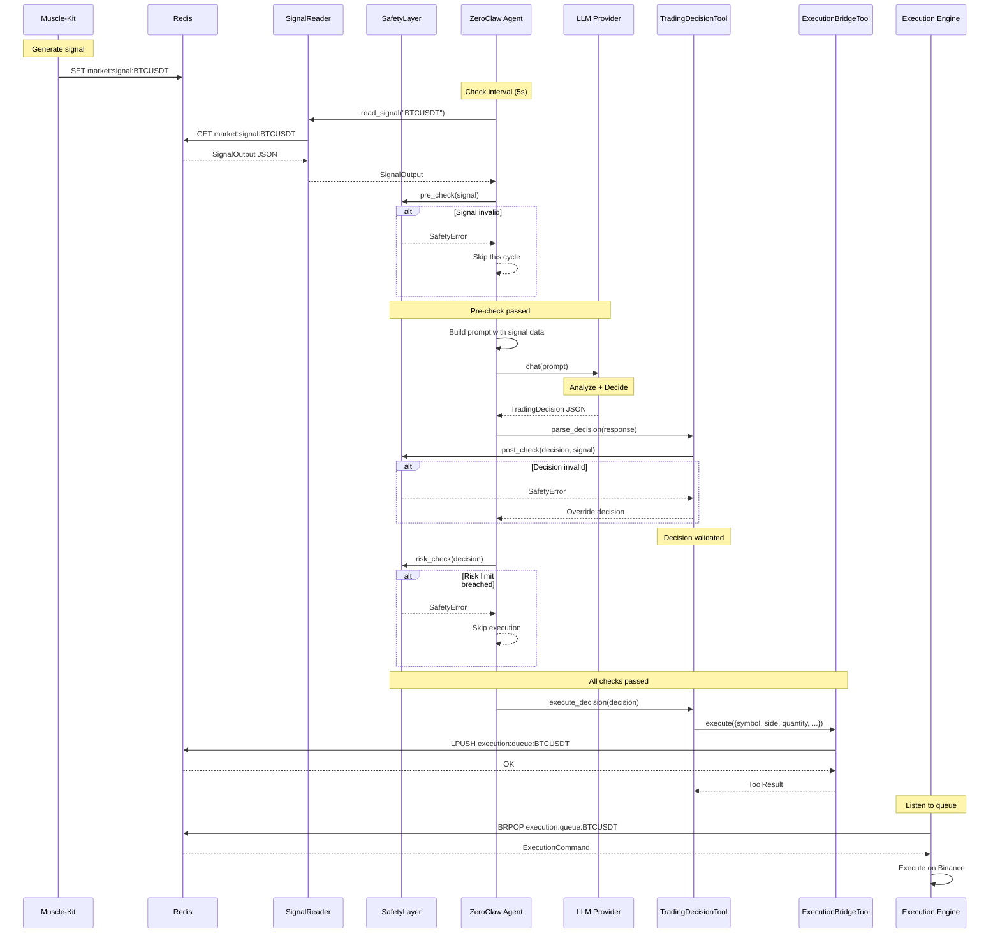

# ZeroClaw Agent Trading Integration Architecture

## Overview

This document describes the architecture for integrating ZeroClaw Agent as the "Brain" for trading decisions, replacing the standalone `crates/brain` with a ZeroClaw Agent-based approach that uses external LLM providers (Claude, GPT-4, Ollama) for decision making.

## Motivation

The current `crates/brain` uses a local LLM (Ollama) for trading decisions. While this provides low-latency responses, it limits the intelligence of decisions. By using ZeroClaw Agent with external LLM providers, we can:

- Leverage more powerful LLMs (Claude, GPT-4)
- Use the full tool ecosystem of ZeroClaw
- Integrate with memory, web search, and other capabilities
- Simplify architecture by reducing crate count

## Architecture Comparison

### Current Architecture (crates/brain)

```
┌─────────────────┐     ┌─────────────────┐     ┌─────────────────┐
│  Muscle-Kit     │────▶│  crates/brain   │────▶│  Execution-Kit  │
│  Signal Engine  │Redis│  (Local LLM)    │Redis│  Trade Executor │
└─────────────────┘     └─────────────────┘     └─────────────────┘
                               │
                               ▼
                        ┌─────────────────┐
                        │  SafetyGate     │
                        │  Risk Monitor   │
                        └─────────────────┘
```

### New Architecture (ZeroClaw Agent)

```
┌─────────────────┐     ┌─────────────────┐     ┌─────────────────┐
│  Muscle-Kit     │────▶│  ZeroClaw Agent │────▶│  Execution-Kit  │
│  Signal Engine  │Redis│  (Claude/GPT-4) │Redis│  Trade Executor │
└─────────────────┘     └────────┬────────┘     └─────────────────┘
                                 │
                                 ▼
                        ┌─────────────────┐
                        │  Trading Tool   │
                        │  Safety Layer   │
                        │  Memory Store   │
                        └─────────────────┘
```

## Components

### 1. Signal Reader Module (`src/agent/trading/signal_reader.rs`)

Responsible for reading signals from Redis and converting them to a format suitable for LLM consumption.

```rust
pub struct SignalReader {
    redis: ConnectionManager,
    key_prefix: String,
}

impl SignalReader {
    pub fn new(redis: ConnectionManager, key_prefix: Option<&str>) -> Self;
    pub async fn read_signal(&mut self, symbol: &str) -> Result<SignalOutput>;
    pub async fn read_signals_batch(&mut self, symbols: &[&str]) -> Result<Vec<SignalOutput>>;
}
```

**Key Responsibilities:**
- Read `SignalOutput` from Redis key `market:signal:{SYMBOL}`
- Validate signal reliability (latency check)
- Convert signal to human-readable format for LLM prompt

### 2. Trading Decision Tool (`src/tools/trading_decision.rs`)

A new tool that the ZeroClaw Agent can call to make trading decisions.

```rust
pub struct TradingDecisionTool {
    config: TradingConfig,
    redis: ConnectionManager,
    safety_layer: Arc<SafetyLayer>,
}

#[async_trait]
impl Tool for TradingDecisionTool {
    fn name(&self) -> &str { "trading_decision" }
    
    fn description(&self) -> &str {
        "Analyze market signals and make trading decisions using AI"
    }
    
    fn parameters_schema(&self) -> Value {
        json!({
            "type": "object",
            "properties": {
                "symbol": {
                    "type": "string",
                    "description": "Trading pair symbol (e.g., BTCUSDT)"
                },
                "action": {
                    "type": "string",
                    "enum": ["analyze", "decide", "monitor"],
                    "description": "Type of trading operation"
                }
            },
            "required": ["symbol", "action"]
        })
    }
    
    async fn execute(&self, args: Value) -> Result<ToolResult>;
}
```

### 3. Safety Layer (`src/agent/trading/safety_layer.rs`)

Multi-layer safety system that validates decisions before execution.

```
┌─────────────────────────────────────────────────────────────┐
│                    Safety Layer                              │
├─────────────────────────────────────────────────────────────┤
│  Layer 1: Pre-Check (Before LLM Call)                        │
│  - Signal latency validation                                 │
│  - Minimum confluence score check                            │
│  - Market regime validation                                  │
├─────────────────────────────────────────────────────────────┤
│  Layer 2: Post-Check (After LLM Decision)                    │
│  - Decision format validation                                │
│  - Leverage limits                                           │
│  - Stop-loss/take-profit validation                          │
│  - Signal direction consistency                              │
├─────────────────────────────────────────────────────────────┤
│  Layer 3: Risk Check (Before Execution)                      │
│  - Daily trade count limit                                   │
│  - Account balance check                                     │
│  - Drawdown monitoring                                       │
│  - Position size limits                                      │
└─────────────────────────────────────────────────────────────┘
```

```rust
pub struct SafetyLayer {
    config: TradingSafetyConfig,
    redis: ConnectionManager,
}

impl SafetyLayer {
    /// Pre-check: Validate signal before calling LLM
    pub fn pre_check(&self, signal: &SignalOutput) -> Result<(), SafetyError>;
    
    /// Post-check: Validate LLM decision
    pub fn post_check(&self, decision: &TradingDecision, signal: &SignalOutput) -> Result<(), SafetyError>;
    
    /// Risk check: Final validation before execution
    pub async fn risk_check(&self, decision: &TradingDecision) -> Result<(), SafetyError>;
}
```

### 4. Execution Bridge Tool (`src/tools/execution_bridge.rs`)

Already exists in the codebase. This tool pushes execution commands to Redis.

```rust
pub struct ExecutionBridgeTool {
    redis: ConnectionManager,
}

#[async_trait]
impl Tool for ExecutionBridgeTool {
    fn name(&self) -> &str { "execution_bridge" }
    
    fn description(&self) -> &str {
        "Execute trading orders by pushing to Redis execution queue"
    }
    
    async fn execute(&self, args: Value) -> Result<ToolResult>;
}
```

### 5. Trading Memory Module (`src/agent/trading/memory.rs`)

Stores trading history and decisions for context and learning.

```rust
pub struct TradingMemory {
    memory: Arc<dyn Memory>,
}

impl TradingMemory {
    /// Store a trading decision with context
    pub async fn store_decision(
        &self,
        symbol: &str,
        signal: &SignalOutput,
        decision: &TradingDecision,
        result: Option<&TradeResult>,
    ) -> Result<()>;
    
    /// Recall recent trading history for a symbol
    pub async fn recall_history(&self, symbol: &str, limit: usize) -> Result<Vec<TradingContext>>;
    
    /// Get trading statistics
    pub async fn get_stats(&self) -> Result<TradingStats>;
}
```

## Data Flow

### Complete Flow: Signal → Decision → Execution



## Configuration Schema

Add new configuration section to `config.toml`:

```toml
# Trading configuration (ZeroClaw Agent as Brain)
[trading]
enabled = true
symbols = ["BTCUSDT", "ETHUSDT"]
check_interval_ms = 5000  # Check signals every 5 seconds
redis_url = "redis://localhost:6379"

# Provider configuration for trading decisions
[trading.provider]
name = "anthropic"  # or "openai", "openrouter", "ollama"
model = "claude-sonnet-4-20250514"
temperature = 0.7
max_tokens = 1000
timeout_secs = 30

# Risk management
[trading.risk]
max_position_size_usd = 1000
max_leverage = 10
max_risk_per_trade = 0.02  # 2% of account
stop_loss_required = true
take_profit_required = true
max_daily_trades = 20
max_drawdown_percent = 5.0

# Safety checks
[trading.safety]
require_llm_reasoning = true
validate_decision_format = true
max_latency_ms = 500
min_confluence_score = 5  # Ignore signals with confluence < 5
require_confluence_minimum = 5
override_leverage_max = 5  # Override LLM if leverage > 5x

# Prompt customization
[trading.prompt]
system_prompt = """You are a professional cryptocurrency trader with 10+ years of experience.
You specialize in technical analysis and risk management.

Rules:
1. Never risk more than 2% per trade
2. Always use stop loss
3. Only trade when confluence score >= 7
4. Prefer trending markets (ADX > 25)
5. Avoid trading during high volatility unless regime is clearly trending

Return decisions in JSON format with clear reasoning."""

# Memory configuration
[trading.memory]
enabled = true
store_decisions = true
store_signals = true
recall_limit = 10  # Number of recent trades to recall
```

## Prompt Templates

### System Prompt

```
You are a professional cryptocurrency trader with 10+ years of experience.
You specialize in technical analysis and risk management.

Your task is to analyze market signals and make trading decisions.

## Rules:
1. Never risk more than 2% per trade
2. Always use stop loss
3. Only trade when confluence score >= 7
4. Prefer trending markets (ADX > 25)
5. Avoid trading during high volatility unless regime is clearly trending

## Response Format:
Return your decision in JSON format:
{
  "decision": "EXECUTE" or "WAIT",
  "action": "LONG", "SHORT", or "NONE",
  "leverage": 1-10,
  "stop_loss": price_level,
  "take_profit": price_level,
  "risk_percent": 0.01-0.05,
  "reasoning": "Detailed explanation of your analysis"
}
```

### User Prompt Template

```
## Market Data for {SYMBOL}

**Current Price**: ${price}
**Market Regime**: {market_regime}
**Confluence Score**: {confluence_score}/10

**Technical Indicators**:
- RSI (14): {rsi}
- MACD: {macd} (Signal: {macd_signal}, Histogram: {macd_histogram})
- ADX: {adx}
- Bollinger Band Width: {bb_width}
- ATR: {atr}
- Ultimate Smoother: {us_value}

**Muscle-Kit Advice**: {trade_advice}

**Account Information**:
- Balance: ${balance}
- Unrealized PnL: ${unrealized_pnl} ({unrealized_pnl_percent}%)
- Active Position: {position_info}

**Recent Trading History**:
{trading_history}

Based on this data, what is your trading decision?
```

## Implementation Phases

### Phase 1: Basic Integration (Week 1-2)

**Goals:**
- Create `SignalReader` module
- Create `TradingDecisionTool`
- Integrate with ZeroClaw Agent loop
- Test with paper trading

**Files to create:**
- `src/agent/trading/mod.rs`
- `src/agent/trading/signal_reader.rs`
- `src/tools/trading_decision.rs`

**Files to modify:**
- `src/tools/mod.rs` - Register new tool
- `src/config/schema.rs` - Add trading config

### Phase 2: Safety Layer (Week 2-3)

**Goals:**
- Implement 3-layer safety system
- Add validation for all decision parameters
- Create override logic for unsafe decisions

**Files to create:**
- `src/agent/trading/safety_layer.rs`
- `src/agent/trading/safety_types.rs`

### Phase 3: Memory & Context (Week 3-4)

**Goals:**
- Implement trading memory storage
- Add context recall for LLM
- Store trading history for analysis

**Files to create:**
- `src/agent/trading/memory.rs`

### Phase 4: Production & Monitoring (Week 4-5)

**Goals:**
- Add PnL tracking
- Add alerting for safety breaches
- Add performance metrics
- Production deployment

**Files to create:**
- `src/agent/trading/monitor.rs`
- `src/agent/trading/metrics.rs`

## Risk Analysis

### Risk 1: LLM Hallucination

**Scenario:** LLM makes incorrect trading decision due to misunderstanding data.

**Mitigation:**
- Multi-layer safety checks
- Require reasoning in response
- Validate against signal direction
- Set conservative defaults

### Risk 2: API Latency

**Scenario:** LLM API response takes too long, missing trade entry.

**Mitigation:**
- Set timeout (default: 30s)
- Use fallback to local LLM
- Skip trade if timeout

### Risk 3: API Cost

**Scenario:** High frequency of decisions leads to high API costs.

**Mitigation:**
- Limit decisions per day
- Only call LLM on signal change
- Use cheaper models for initial filtering

### Risk 4: Dependency on External API

**Scenario:** API outage prevents trading.

**Mitigation:**
- Implement fallback to local Ollama
- Cache last known good decision
- Alert on API failures

## Testing Strategy

### Unit Tests

- Test `SignalReader` with mock Redis
- Test `SafetyLayer` with various signal/decision combinations
- Test prompt generation

### Integration Tests

- Test full flow: Signal → Agent → Decision → Execution
- Test with paper trading (no real money)
- Test safety layer overrides

### Load Tests

- Test with multiple symbols simultaneously
- Test API rate limit handling
- Test memory usage over time

## Migration Path

### Option 1: Parallel Run (Recommended)

1. Run both `crates/brain` and ZeroClaw Agent trading in parallel
2. Compare decisions between both systems
3. Gradually shift traffic to ZeroClaw Agent
4. Deprecate `crates/brain` after validation

### Option 2: Feature Flag

1. Add `trading-agent` feature flag
2. Users can opt-in to new system
3. Collect feedback and iterate
4. Make default after stabilization

## Conclusion

This architecture provides a flexible, safe way to use ZeroClaw Agent for trading decisions while maintaining the safety guarantees of the original `crates/brain` system. The multi-layer safety approach ensures that even if the LLM makes mistakes, the system will protect against catastrophic losses.
