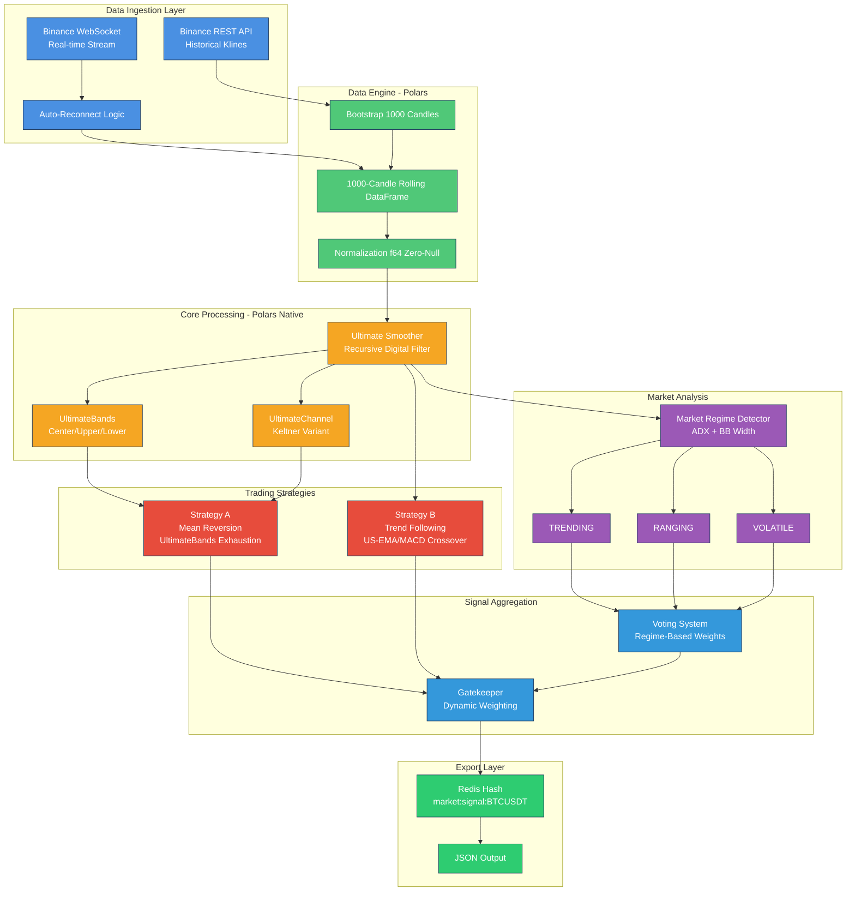

# ZeroClaw "The Muscle" - Signal Engine Implementation Plan

## Executive Summary

"The Muscle" is a high-frequency trading signal engine for ZeroClaw that implements a complete data pipeline from Binance, processes market data using Polars.rs DataFrames, and exports trading signals to Redis. It features a recursive digital filter (Ultimate Smoother), multiple trading strategies, and dynamic regime-based signal aggregation.

## Technical Optimizations

### 1. High-Performance Recursive Filter (Ultimate Smoother)

The Ultimate Smoother is a 2nd-order recursive filter where `US[n]` depends on `US[n-1]` and `US[n-2]`. Vectorized operations in Polars do not natively handle row-dependency efficiently.

**Implementation Strategy:**
- Do NOT use pure LazyFrame expressions for the recursive calculation
- Extract input Series as a slice `&[f64]`
- Pre-allocate output `Vec<f64>`
- Perform calculation using a single iterative pass
- Wrap logic in a helper function in `smoother.rs` to minimize memory overhead
- Handle first two indices safely (n=0, n=1) to avoid out-of-bounds access

### 2. Mathematical Convergence (Warm-up Offset)

Recursive indicators and long-period EMAs require a "burn-in" period to converge to accurate values.

**Implementation:**
- Fetch **1100 candles** from Binance REST API (not 1000)
- Use first **100 candles** as a "Warm-up" buffer
- Calculate indicators for all 1100 candles
- Only export signals to Redis starting from the **101st candle** (index 100)
- This ensures the first published signal is mathematically mature

### 3. Real-time Ingestion Latency Monitoring

In HFT-lite systems, stale data is a major risk. Track "Time-drift" from exchange to engine.

**Implementation:**
- Add `ingestion_latency_ms` field to `SignalOutput` struct
- Calculate: `ingestion_latency_ms = current_system_time_ms - kline_close_time_ms`
- Add `max_allowed_latency_ms` config parameter (default: 500ms)
- If latency exceeds threshold: force `trade_advice` to `WAIT` with reason `LATENCY_SPIKE`
- Include latency value in Redis JSON output for monitoring

---

## 1. Module Structure

```
src/muscle/
├── mod.rs                    # Module exports and factory
├── traits.rs                 # TradingStrategy trait, Signal enum
├── config.rs                 # MuscleConfig schema
├── data/
│   ├── mod.rs
│   ├── models.rs             # Kline, Signal, MarketRegime structs
│   ├── binance_rest.rs       # Historical klines fetch (bootstrap)
│   └── binance_ws.rs         # WebSocket stream with auto-reconnect
├── engine/
│   ├── mod.rs
│   ├── dataframe.rs          # Polars DataFrame manager (1000-candle window)
│   ├── smoother.rs           # Ultimate Smoother recursive filter
│   ├── bands.rs              # UltimateBands (BB variant)
│   └── channel.rs            # UltimateChannel (Keltner variant)
├── strategies/
│   ├── mod.rs
│   ├── regime.rs             # Market Regime Detector (ADX + BB Width)
│   ├── mean_reversion.rs     # Strategy A: UltimateBands exhaustion
│   └── trend_following.rs    # Strategy B: US-EMA/MACD crossover
├── aggregator.rs             # Gatekeeper voting/weighting system
└── redis_store.rs            # Redis client for signal export
```

---

## 2. Architecture Diagram



---

## 3. Dependencies

Add to [`Cargo.toml`](../Cargo.toml):

```toml
# Data Engine - Polars for high-performance DataFrame operations
polars = { version = "0.46", features = ["lazy", "dtype-f64", "temporal", "rolling_window", "performant"] }
polars-lazy = "0.46"
polars-core = "0.46"
polars-ops = "0.46"

# State Store - Redis async client
redis = { version = "0.29", features = ["aio", "tokio-comp", "connection-manager"] }

# Feature flag for muscle module
[features]
default = ["channel-nostr"]
muscle = ["dep:polars", "dep:redis"]
# ... existing features
```

---

## 4. Configuration Schema

Add `MuscleConfig` to [`src/config/schema.rs`](../src/config/schema.rs):

```rust
#[derive(Debug, Clone, Serialize, Deserialize, JsonSchema)]
pub struct MuscleConfig {
    /// Enable/disable the muscle signal engine
    #[serde(default)]
    pub enabled: bool,
    
    /// Trading pairs to monitor (e.g., ["BTCUSDT", "ETHUSDT"])
    #[serde(default = "default_muscle_pairs")]
    pub pairs: Vec<String>,
    
    /// Time intervals (e.g., ["1m", "5m", "15m", "1h"])
    #[serde(default = "default_muscle_intervals")]
    pub intervals: Vec<String>,
    
    /// Redis connection URL (default: "redis://localhost:6379")
    #[serde(default = "default_redis_url")]
    pub redis_url: String,
    
    /// Strategy weights (can be overridden by regime)
    #[serde(default)]
    pub strategy_weights: StrategyWeightsConfig,
    
    /// Ultimate Smoother parameters
    #[serde(default)]
    pub smoother: SmootherConfig,
}

#[derive(Debug, Clone, Serialize, Deserialize, JsonSchema)]
pub struct StrategyWeightsConfig {
    #[serde(default = "default_mean_reversion_weight")]
    pub mean_reversion: f64,
    #[serde(default = "default_trend_following_weight")]
    pub trend_following: f64,
}

#[derive(Debug, Clone, Serialize, Deserialize, JsonSchema)]
pub struct SmootherConfig {
    #[serde(default = "default_c1")]
    pub c1: f64,
    #[serde(default = "default_c2")]
    pub c2: f64,
    #[serde(default = "default_c3")]
    pub c3: f64,
}

/// Performance and safety configuration
#[derive(Debug, Clone, Serialize, Deserialize, JsonSchema)]
pub struct MusclePerformanceConfig {
    /// Maximum allowed ingestion latency in milliseconds (default: 500ms)
    /// If exceeded, trade_advice is forced to WAIT with LATENCY_SPIKE reason
    #[serde(default = "default_max_allowed_latency_ms")]
    pub max_allowed_latency_ms: i64,
    
    /// Number of warm-up candles for indicator convergence (default: 100)
    #[serde(default = "default_warmup_candles")]
    pub warmup_candles: usize,
    
    /// Total candles to fetch from REST API (warmup + working window, default: 1100)
    #[serde(default = "default_total_candles")]
    pub total_candles: usize,
}

fn default_max_allowed_latency_ms() -> i64 { 500 }
fn default_warmup_candles() -> usize { 100 }
fn default_total_candles() -> usize { 1100 }
```

---

## 5. Core Implementation Details

### 5.1 Data Models

```rust
// src/muscle/data/models.rs

#[derive(Debug, Clone, Serialize, Deserialize)]
pub struct Kline {
    pub timestamp_ms: i64,
    pub open: f64,
    pub high: f64,
    pub low: f64,
    pub close: f64,
    pub volume: f64,
    pub is_closed: bool,
    /// Server-side receive timestamp for latency tracking
    pub received_at_ms: i64,
}

#[derive(Debug, Clone, Serialize, Deserialize, PartialEq)]
pub enum MarketRegime {
    Trending,
    Ranging,
    Volatile,
}

#[derive(Debug, Clone, Serialize, Deserialize, PartialEq)]
pub enum Signal {
    Long { strength: f64 },
    Short { strength: f64 },
    Wait,
}

#[derive(Debug, Clone, Serialize, Deserialize)]
pub struct SignalOutput {
    pub price: f64,
    pub timestamp_ms: i64,
    pub market_regime: MarketRegime,
    pub confluence_score: i8,  // -10 to +10
    pub indicator_snapshot: IndicatorSnapshot,
    pub trade_advice: Signal,
    /// Latency from kline close to signal generation (ms)
    pub ingestion_latency_ms: i64,
    /// Reason if trade_advice was overridden (e.g., "LATENCY_SPIKE")
    pub override_reason: Option<String>,
}

#[derive(Debug, Clone, Serialize, Deserialize)]
pub struct IndicatorSnapshot {
    pub rsi: f64,
    pub bb_upper: f64,
    pub bb_lower: f64,
    pub us_value: f64,
    pub adx: f64,
    pub bb_width: f64,
}
```

### 5.2 Ultimate Smoother Formula (High-Performance Implementation)

```rust
// US[n] = (1-c1)*D[n] + (2c1-c2)*D[n-1] - (c1+c3)*D[n-2] + c2*US[n-1] + c3*US[n-2]
//
// Where:
// - D[n] = input data (typical price: (H+L+C)/3)
// - c1, c2, c3 = filter coefficients
// - Default coefficients tuned for minimal lag and noise reduction
//
// PERFORMANCE OPTIMIZATION:
// - Do NOT use Polars LazyFrame expressions for recursive calculation
// - Extract input Series as slice &[f64] with ZERO-COPY
// - Use .rechunk() to ensure contiguous memory before slicing
// - Pre-allocate output Vec<f64> with capacity = input.len()
// - Single iterative pass with O(n) complexity
// - Handle boundary conditions: US[0] = D[0], US[1] = D[1] (warm-up)
//
// MEMORY OPTIMIZATION (Zero-Copy from Polars):
// - Polars Series can be composed of multiple memory chunks
// - Use .rechunk() to consolidate into single contiguous block
// - Use .contig_slice() or .as_slice() after rechunk for zero-copy access
// - Ensures CPU cache locality during iterative pass

// Core iterative function - expects a contiguous slice
pub fn compute_ultimate_smoother(
    input: &[f64],
    c1: f64,
    c2: f64,
    c3: f64,
) -> Vec<f64> {
    let n = input.len();
    let mut output = Vec::with_capacity(n);
    
    // Boundary conditions: initialize first two values
    if n > 0 {
        output.push(input[0]); // US[0] = D[0]
    }
    if n > 1 {
        output.push(input[1]); // US[1] = D[1]
    }
    
    // Iterative calculation for n >= 2
    for i in 2..n {
        let us_n = (1.0 - c1) * input[i]
                 + (2.0 * c1 - c2) * input[i - 1]
                 - (c1 + c3) * input[i - 2]
                 + c2 * output[i - 1]
                 + c3 * output[i - 2];
        output.push(us_n);
    }
    
    output
}

// Helper function to extract zero-copy slice from Polars Series
pub fn extract_f64_slice_from_series(series: &polars::prelude::Series) -> anyhow::Result<&[f64]> {
    use polars::prelude::*;
    
    // Ensure data type is f64
    let f64_series = series.cast(&DataType::Float64)?;
    
    // Rechunk to ensure contiguous memory (critical for zero-copy slice)
    let rechunked = f64_series.rechunk();
    
    // Downcast to Float64Chunked
    let chunked = rechunked.f64()?;
    
    // Get contiguous slice - this is zero-copy if data is contiguous after rechunk
    chunked.contig_slice()
        .ok_or_else(|| anyhow::anyhow!("Failed to get contiguous slice from Float64Chunked"))
}

// Usage example in dataframe.rs or smoother.rs:
// let series = df.column("typical_price")?.f64()?;
// let data_slice: &[f64] = extract_f64_slice_from_series(series)?;
// let smoothed_data = compute_ultimate_smoother(data_slice, c1, c2, c3);
```

**Technical Justification:**

| Optimization | Benefit |
|--------------|---------|
| `.rechunk()` | Consolidates fragmented memory chunks into single block |
| `.contig_slice()` | Zero-copy access to underlying memory |
| Cache locality | CPU cache hits during iterative loop |
| No intermediate Vec | Avoids allocation overhead for input data |
| HFT-standard | Maintains sub-millisecond processing latency |

### 5.3 TradingStrategy Trait

```rust
// src/muscle/traits.rs

use polars::prelude::DataFrame;

#[async_trait]
pub trait TradingStrategy: Send + Sync {
    fn name(&self) -> &str;
    fn description(&self) -> &str;
    
    /// Analyze the DataFrame and return a trading signal
    fn analyze(&self, df: &DataFrame, regime: &MarketRegime) -> Signal;
    
    /// Get the weight for this strategy based on market regime
    fn weight(&self, regime: &MarketRegime) -> f64;
}
```

### 5.4 Market Regime Detection

```rust
// Market Regime Logic:
// - TRENDING: ADX > 25
// - RANGING: ADX < 20 AND BB Width < 0.05 (5%)
// - VOLATILE: BB Width > 0.10 (10%) OR ADX rising rapidly (>5 points in 10 candles)
```

### 5.5 Strategy Implementations

**Strategy A - Mean Reversion:**
- Entry: Price touches UltimateBands Lower + RSI < 30
- Exit: Price crosses US center line
- Filter: Only in RANGING regime

**Strategy B - Trend Following:**
- Entry: US-smoothed EMA crossover + MACD histogram positive
- Exit: EMA cross back or MACD divergence
- Filter: Only in TRENDING regime

### 5.6 Gatekeeper Voting System

| Regime | Mean Reversion Weight | Trend Following Weight |
|--------|----------------------|------------------------|
| TRENDING | 0.3 | 0.7 |
| RANGING | 0.7 | 0.3 |
| VOLATILE | 0.5 | 0.5 |

Confluence Score Calculation:
```
score = sum(signal_value * weight) * 10
where signal_value: Long=1, Short=-1, Wait=0
```

### 5.7 Redis Output Format (with Latency Monitoring)

```json
{
  "price": 95432.50,
  "timestamp_ms": 1710288000000,
  "market_regime": "TRENDING",
  "confluence_score": 7,
  "indicator_snapshot": {
    "rsi": 62.5,
    "bb_upper": 96000.0,
    "bb_lower": 94000.0,
    "us_value": 95200.0,
    "adx": 28.5,
    "bb_width": 0.042
  },
  "trade_advice": "LONG",
  "ingestion_latency_ms": 45,
  "override_reason": null
}
```

**Latency Safety Trigger:**
- If `ingestion_latency_ms > max_allowed_latency_ms` (default 500ms):
  - `trade_advice` is forced to `WAIT`
  - `override_reason` is set to `"LATENCY_SPIKE"`
  - Signal is still published (for monitoring) but marked as stale

Redis Key: `market:signal:{SYMBOL}` (e.g., `market:signal:BTCUSDT`)
Redis Type: Hash

---

## 6. Implementation Steps

### Phase 1: Foundation (Steps 1-6)
1. Create module structure
2. Add dependencies to Cargo.toml
3. Define data models (with `ingestion_latency_ms` and `received_at_ms` fields)
4. Implement Binance REST client (fetch 1100 candles, not 1000)
5. Implement Binance WebSocket client with auto-reconnect logic
6. Create Polars DataFrame manager (1000-candle working window after warm-up)

### Phase 2: Core Processing (Steps 7-9)
7. Implement Ultimate Smoother (iterative Rust loop, NOT Polars LazyFrame)
8. Implement UltimateBands
9. Implement UltimateChannel

### Phase 3: Strategies (Steps 10-13)
10. Define TradingStrategy trait
11. Implement Market Regime Detector
12. Implement Strategy A (Mean Reversion)
13. Implement Strategy B (Trend Following)

### Phase 4: Aggregation & Export (Steps 14-17)
14. Implement Gatekeeper voting system
15. Implement Redis client
16. Integrate with agent loop
17. Add configuration schema

### Phase 5: Testing & Documentation (Steps 18-20)
18. Write unit tests (include boundary tests for US filter indices 0, 1, 2)
19. Write integration tests (include latency spike simulation)
20. Update documentation

---

## 7. Risk Classification

**Risk Level: MEDIUM**

**Rationale:**
- Introduces new dependencies (Polars, Redis) but does not modify existing security boundaries
- New module is isolated behind a feature flag (`muscle`)
- Does not modify `src/security/`, `src/runtime/`, or `src/gateway/` core logic
- Follows existing trait-driven architecture pattern

**Additional Safety Considerations:**
- Latency monitoring prevents stale data from triggering trades
- Warm-up period ensures mathematical convergence before signal export
- Iterative US implementation avoids Polars recursion limitations and OOB errors

**Validation Requirements:**
- Full test suite for all strategies and indicators
- Integration tests for WebSocket reconnection
- Benchmark tests for Polars DataFrame operations
- Documentation of all configuration options

---

## 8. Integration Points

### 8.1 Agent Loop Integration

The muscle module will be triggered on candle-close events:

```rust
// In src/agent/mod.rs (or new muscle runtime)
if config.muscle.enabled {
    let signal = muscle_engine.process_candle_close(&kline).await?;
    redis_store.publish_signal(&symbol, &signal).await?;
}
```

### 8.2 Tool Integration

Expose a tool for querying signals:

```rust
pub struct SignalQueryTool {
    redis_client: redis::Client,
}

#[async_trait]
impl Tool for SignalQueryTool {
    fn name(&self) -> &str { "get_market_signal" }
    fn description(&self) -> &str { "Get current market signal from the muscle engine" }
    // ...
}
```

---

## 9. Performance Considerations

1. **Polars LazyFrame**: Use lazy evaluation for indicator calculations
2. **No Unnecessary Cloning**: Pass DataFrame references, use `clone_ref()` where needed
3. **Async Redis**: Use connection pooling with `redis::aio::ConnectionManager`
4. **WebSocket Reconnect**: Exponential backoff with max 30s delay
5. **Memory Management**: Rolling window maintains fixed 1000-candle size

---

## 10. Testing Strategy

### Unit Tests
- Ultimate Smoother formula correctness (including boundary indices 0, 1, 2)
- Ultimate Smoother performance benchmark (vs. naive implementation)
- UltimateBands calculation
- Market Regime classification
- Strategy signal generation
- Latency spike detection and override logic
- Warm-up buffer behavior (first 100 candles excluded from export)

### Integration Tests
- Binance REST API bootstrap (verify 1100 candles fetched)
- WebSocket stream with simulated disconnect
- Redis signal export (verify latency field present)
- End-to-end candle processing
- Latency threshold enforcement (simulate delayed kline)

### Benchmark Tests
- DataFrame update latency
- Indicator calculation throughput
- WebSocket message processing time

---

## 11. Documentation

Create `docs/reference/muscle-signal-engine.md` covering:
- Architecture overview
- Configuration reference
- Indicator formulas
- Strategy descriptions
- Redis output schema
- Troubleshooting guide

---

## 12. Files to Create/Modify

### New Files
- `src/muscle/mod.rs`
- `src/muscle/traits.rs`
- `src/muscle/config.rs`
- `src/muscle/data/mod.rs`
- `src/muscle/data/models.rs`
- `src/muscle/data/binance_rest.rs`
- `src/muscle/data/binance_ws.rs`
- `src/muscle/engine/mod.rs`
- `src/muscle/engine/dataframe.rs`
- `src/muscle/engine/smoother.rs`
- `src/muscle/engine/bands.rs`
- `src/muscle/engine/channel.rs`
- `src/muscle/strategies/mod.rs`
- `src/muscle/strategies/regime.rs`
- `src/muscle/strategies/mean_reversion.rs`
- `src/muscle/strategies/trend_following.rs`
- `src/muscle/aggregator.rs`
- `src/muscle/redis_store.rs`
- `docs/reference/muscle-signal-engine.md`

### Modified Files
- `Cargo.toml` - Add dependencies and feature flag
- `src/lib.rs` - Add muscle module export
- `src/config/schema.rs` - Add MuscleConfig and MusclePerformanceConfig
- `src/main.rs` - Add muscle CLI commands (optional)

---

## 13. Success Criteria

1. Module compiles with `cargo build --features muscle`
2. All unit tests pass: `cargo test --features muscle`
3. WebSocket maintains connection with auto-reconnect
4. Signals are published to Redis on candle close
5. Configuration is loadable from `config.toml`
6. Documentation is complete and accurate
